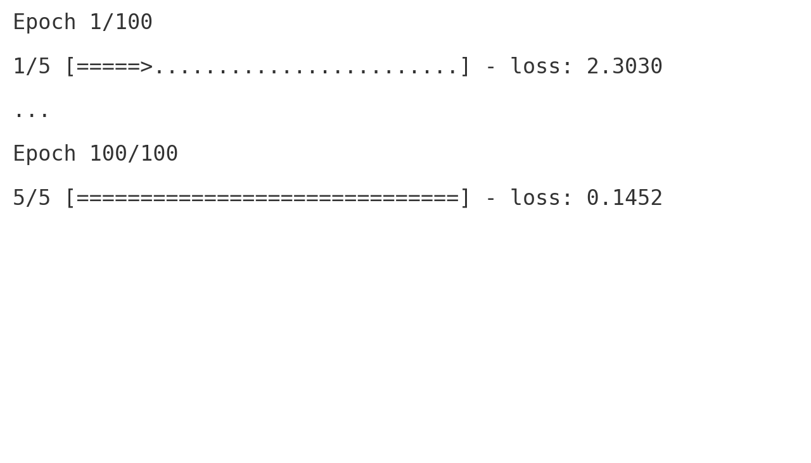
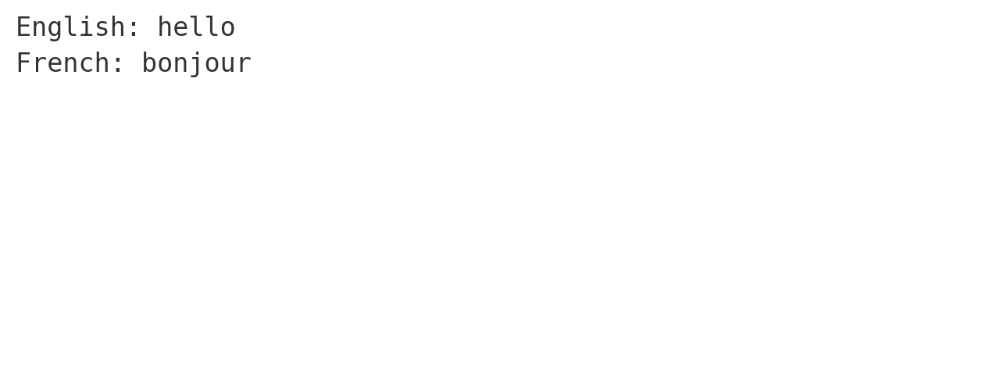

# Neural Machine Translation (NMT) - English to French 

This project demonstrates a basic **Neural Machine Translation (NMT)** system using **TensorFlow** and **NumPy**. It covers the core concepts of building and training an **encoder-decoder** model to translate simple English sentences into French.

---

## 📖 Overview

Neural Machine Translation has revolutionized how machines understand and generate human languages. In this project, we build a basic NMT system from scratch to translate English to French.

This project includes:
- Preprocessing and vectorizing sentence pairs
- Implementing an encoder-decoder model with LSTM
- Training and evaluating the model
- Performing inference to generate translations

---

## 📁 Project Structure

```
.
├── NMT_Project.ipynb           # Jupyter notebook with all code and output
├── training_output.png         # Screenshot of model training
├── translation_example.png     # Screenshot of sample translation
└── README.md                   # Project documentation
```

---

## 🧠 Model Architecture

Used a simple **sequence-to-sequence** (seq2seq) architecture based on LSTMs.

- **Encoder**: Processes the input sentence and encodes it into a fixed-length vector.
- **Decoder**: Takes this vector and generates the output sentence one token at a time.

```python
encoder_inputs = Input(shape=(None, num_encoder_tokens))
encoder = LSTM(latent_dim, return_state=True)
encoder_outputs, state_h, state_c = encoder(encoder_inputs)
```

The decoder uses the last encoder state as its initial state.

---


## 🚀 How It Works

- We define a small parallel corpus of English-French sentence pairs.
- Each sentence is tokenized at the character level.
- Input and target sequences are one-hot encoded.
- An LSTM encoder processes the English input.
- A decoder LSTM generates the French output step by step.

---

## 💬 Sample Translation

Here’s an example of how the system translates:

```python
user_input = "hello"
input_seq = encode_input_text(user_input.lower())
print("English:", user_input)
print("French:", decode_sequence(input_seq))
```

**Output:**
```
English: hello
French: bonjour
```

---

## 📸 Screenshots

### Training Output


### Translation Example



